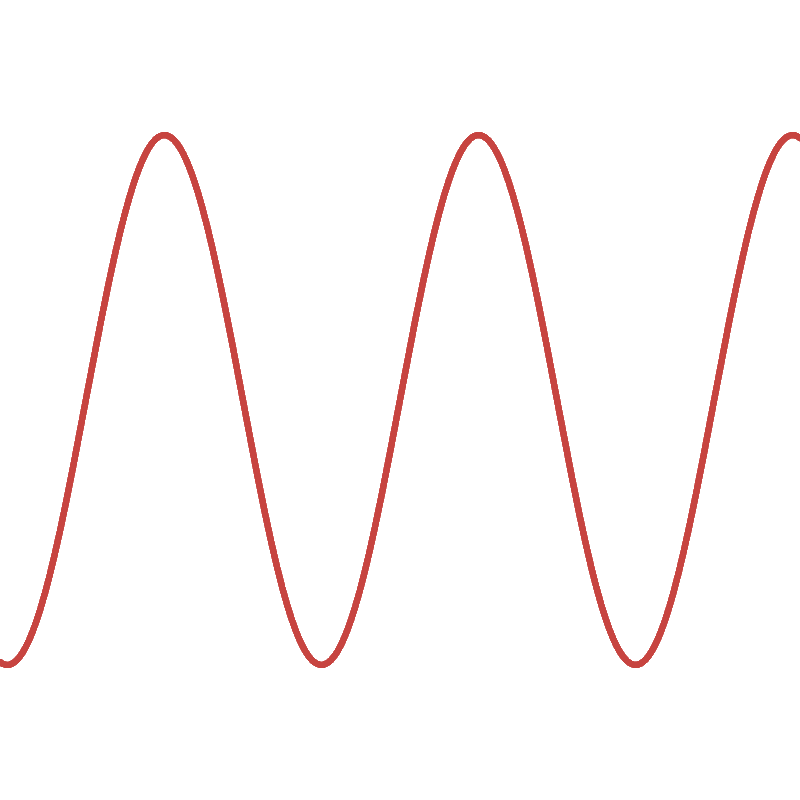

```mermaid  
graph TD  
    A[Sound Waves] --> B[Periodic]  
    A --> C[Aperiodic]  
    B --> D[Simple]  
    B --> E[Complex]  
    C --> F[Continuous]  
    C --> G[Transient]  
    D --> H[Pure Tone]  
    E --> I[Complex Tone]  
    F --> J[Noise]  
    G --> K[Pulse]  

    %% Invisible alignment nodes  
    H -.-> L[" "]  
    I -.-> M[" "]  
    J -.-> N[" "]  
    K -.-> O[" "]  
    style L height:0px,width:0px  
    style M height:0px,width:0px  
    style N height:0px,width:0px  
    style O height:0px,width:0px  
    linkStyle 8,9,10,11 stroke-width:0px  

    %% Waveform examples (aligned under terminal nodes)  
    subgraph Waveform Examples  
        L[""]  
        M[""]  
        N[""]  
        O[""]  
    end  
