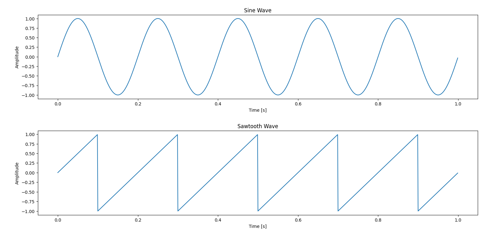

# Creating Complex Sounds from Simple Sine Waves in Praat

Thank you very much everybody I decided to be a good man!

## Objective
In this exercise, you'll learn how to create a sound using sine waves. You'll begin by creating a single sine wave and gradually add more sine waves. As you add more, observe the changes in the sound and its shape. Eventually, you will notice that the sound you are creating resembles a new kind of wave, known as a **sawtooth wave**. Below are the visual representations of a sine wave and a sawtooth wave for comparison.

### Visualizing the Waves
Here’s an example of what sine and sawtooth waves look like:


*Figure 1: A sine wave over three periods.*


---

> **Warning**  
> Since you are about to create audio waves, you have to be careful with the sound levels. Keep your computer's volume at a reasonable level before playing any sounds to avoid damaging your hearing or hardware. Start with a low volume and adjust only after assessing the sound.

---

## Step 1: Creating a Simple Sine Wave

1. Open **Praat** and go to `New > Sound > Create Sound from formula...`.
2. In the dialog box, use the following parameters:
   - **Name**: Enter a name for your sound (e.g., `sineWave`).
   - **Start time (s)**: Set it to `0`.
   - **End time (s)**: Set it to `1` (for a 1-second sound).
   - **Sampling frequency (Hz)**: Set it to `44100 Hz`.
   - **Formula**: Enter the formula to create a basic sine wave:
     ```praat
     0.5 * sin(2 * pi * 440 * x)
     ```
3. This creates a sine wave with a frequency of 440 Hz (a standard A note). The factor `0.5` ensures the amplitude of the resulting sound stays within the acceptable range in Praat.
4. Click `OK` and then play the sound to hear the pure sine wave.

---

## Step 2: Adding a Second Sine Wave (First Harmonic)

1. Next, we’ll add another sine wave that has a higher frequency, known as a harmonic.
2. Go back to `New > Sound > Create Sound from formula...`.
3. In the dialog box, use the following formula to add the first harmonic:
```praat
   0.5 * (sin(2 * pi * 440 * x) + (1/2) * sin(2 * pi * 880 * x))
```
## Step 3: Adding More Harmonics

Now, we will continue adding more sine waves at even higher frequencies. Each new sine wave (harmonic) will be a multiple of the base frequency (440 Hz) and will have a smaller amplitude.
Use the following formula to add the second harmonic:
```praat
   0.5 * (sin(2 * pi * 440 * x) + (1/2) * sin(2 * pi * 880 * x) + (1/3) * sin(2 * pi * 1320 * x))
```

Continue this process by adding more harmonics up to around 10. Here’s how you would add more harmonics:
```praat
   0.5 * (sin(2 * pi * 440 * x) + (1/2) * sin(2 * pi * 880 * x) + (1/3) * sin(2 * pi * 1320 * x) + (1/4) * sin(2 * pi * 1760 * x) + (1/5) * sin(2 * pi * 2200 * x) + (1/6) * sin(2 * pi * 2640 * x) + (1/7) * sin(2 * pi * 3080 * x) + (1/8) * sin(2 * pi * 3520 * x) + (1/9) * sin(2 * pi * 3960 * x) + (1/10) * sin(2 * pi * 4400 * x))
```

After adding several harmonics, the sound will begin to change in a more dramatic way. Continue to play the sound and observe how it changes.

## Step 4: Visualizing and Discovering a New Wave Shape

Use Praat’s View and Edit tool to open the waveform.
Take a screenshot of the waveform after each stage:
After adding one sine wave,
After adding two sine waves,
After adding three sine waves,
and so on.
Observation: What do you notice about the shape of the waveform as you add more sine waves?
After adding enough harmonics, the waveform will resemble what is known as a sawtooth wave. This exercise demonstrates that a sawtooth wave is a combination of many sine waves of different frequencies.

## Deliverables

Submit screenshots of the waveform at different stages:
After adding one sine wave,
After adding two sine waves,
After adding three sine waves,
Continue this for each additional harmonic.
Reflection: Write a brief reflection on how the sound changes as you add each new sine wave. In your reflection, address the following:
What do you observe in the shape of the waveform?
How does the sound evolve as you introduce more harmonics?
Submission Deadline: 19 October 2024.

## Conclusion

By the end of this exercise, you will have learned how to create complex sounds by adding sine waves and visualizing their waveforms. You will also have a practical understanding of Fourier's theorem, which tells us that any periodic waveform can be represented as the sum of sine waves with different frequencies and amplitudes.

In particular, for a sawtooth wave, we can say that it is created by adding sine waves at each successive integer multiple of the fundamental frequency. The amplitude of each sine wave is inversely proportional to its harmonic number (or partial number). This means that as you go up in frequency, the contribution of each sine wave to the overall shape of the sawtooth wave decreases, resulting in the characteristic sharp edges of the waveform.
