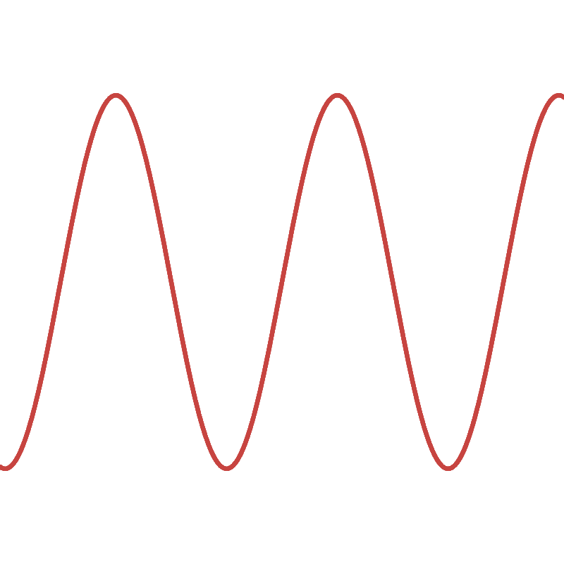

<link rel="stylesheet" href="/style.css">

<table class="wave-table">
  <tr>
    <th colspan="4">Wave Types</th>
  </tr>
  <tr>
    <td colspan="2">Periodic</td>
    <td colspan="2">Aperiodic</td>
  </tr>
  <tr>
    <td>Sine</td>
    <td>Complex</td>
    <td>Noise</td>
    <td>Pulse</td>
  </tr>
  <tr>
    <td></td>
    <td></td>
    <td></td>
    <td></td>
  </tr>
</table>

